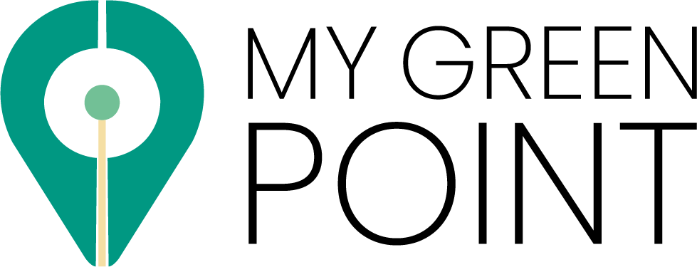
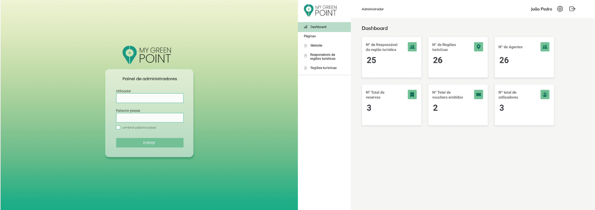

<center>



</br>

# Project for the curricular unit "Projeto Integrado 4"

  
  
  <a href="https://github.com/dsbastos/PI4-Projeto/">
    
  </a>
   <a href="https://github.com/dsbastos/PI4-Projeto/stargazers">
    
  </a>


</br>

[About](#about) •
[Layout](#layout) •
[Techs](#tech) •
[Getting Started](#gettingStarted) •
[Authors](#authors)

</br>

  [](public/../Backoffice/public/app-readme.png)

</center>

<div id="about"></div>

## 💻 About

Project developed for my university course and a enterprise.

For this project we proposed together with the company VISION4YOU a solution to develop and implement a digital platform to simplify the relationship between visitors and local agents.

For this we have as objectives, increase knowledge about the territory and the theme of sustainability among local actors related to tourism, and increase the benefits of tourism for the local economy. Offer visitors a quality experience, promote genuine tourism products that allow visitors to discover, understand and establish a relationship with the territory.

And to achieve these goals we will have to divide the project into three main components, a backoffice portal, web application and finally an application for mobile devices.

In this repository you will find backend e backoffice projects.

---

<div id="layout"></div>

## 🎨 Layout

The layout was created by all authors involved. You can view the project layout through <a href="">this link</a>.

---

<div id="tech"></div>

## 🛠️ Tech

The following tools were used in the construction of the project:

- **[Html](https://developer.mozilla.org/en-US/docs/Glossary/HTML)**
- **[Bootstrap](https://getbootstrap.com/)**
- **[React](https://reactjs.org/)**
- **[Vite](https://vitejs.dev/)**
- **[Node](https://nodejs.org/en/)**
- **[Express](https://expressjs.com/)**

---

<div id="gettingStarted"></div>

## Getting Started

**For run backend ⬇️**:

```bash
cd backend
npm i 
# or 
yarn install

npm run dev 
# or
yarn dev
```

The backend will run here [http://localhost:3333](http://localhost:3333).

**For run backoffice ⬇️**:

```bash
cd backoffice
npm i 
# or 
yarn install

npm run dev 
# or
yarn dev
```

Open [http://localhost:8001](http://localhost:8001) with your browser to see the backoffice App.

---

<div id="authors"></div>

## 🧑🏻 Authors

[](https://www.linkedin.com/in/daniel-bastos98/),
[](https://www.linkedin.com/in/tiago-borges-35a914231/),
[](https://www.linkedin.com/in/constan%C3%A7a-fernandes-6b165a1ba/), Iago Gonçalves, Marco Rocha
